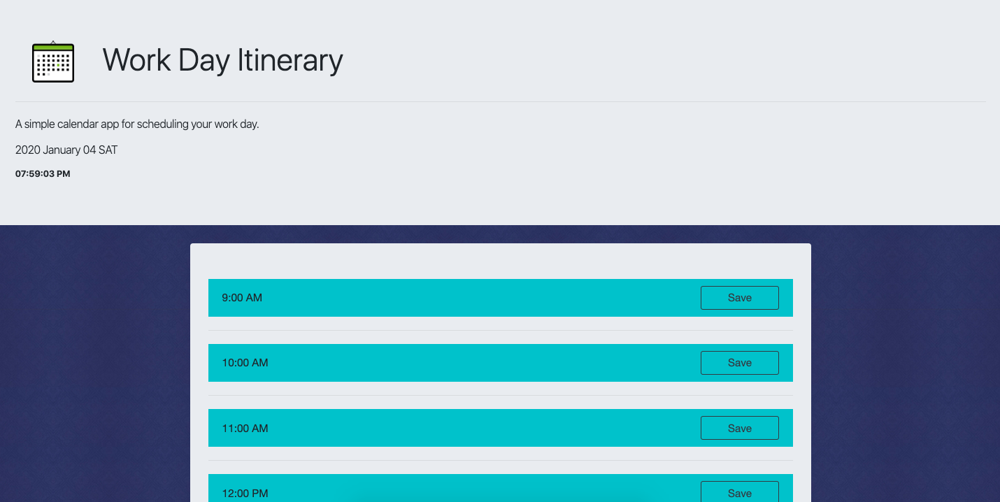

# Daily Planner Application

[Visit the Work Day Itinerary Page](https://kaitlyncarlson.github.io/Work-Day-Planner/)

## Purpose

The purpose of this application is to help make managing time easier for the user. It is tailored to users working a 9 AM - 5PM job. It is intended to aid employees in navigating their daily work load and responsibilities, as well as increasing productivity. It accomplishes this through several features. Each hour between 9 and 5 is alloted an area to enter an itinerary that is editable. This is useful for users who may have a schedule that frequently changes. Each time slot utilizes color coordination according to the user's local time. If a time slot is in the past it is bright blue, if it is current it is bright green, and if a time slot is in the future it is purple.

## Functionality

The top of this application displays a description of the page's purpose and intent for visiting users. It also utilizes Moment.js to display the **current date** as well as a **live interval of the current time** for users.

The calendar portion of the application displays nine rows. Each row is dedicated to an hour time slot between 9AM and 5PM. Each of these rows contains three columns. The first column displaying which hour it has been dedicated to. The second column offering a **textarea in which users may enter and edit** their events. The third column contains a save button for users to save their adjusted itinerary.

In order to help users navigate their itinerary throughout the day each row is color coded as mentioned in the purpose statement. This color code is determined by the **live interval of the current time**. Once the clock hits the next hour, the colors are adjusted to reflect the new current hour, past hours, and future hours.

This application does not currently have necessary code to move between past events and future but it certainly will.
